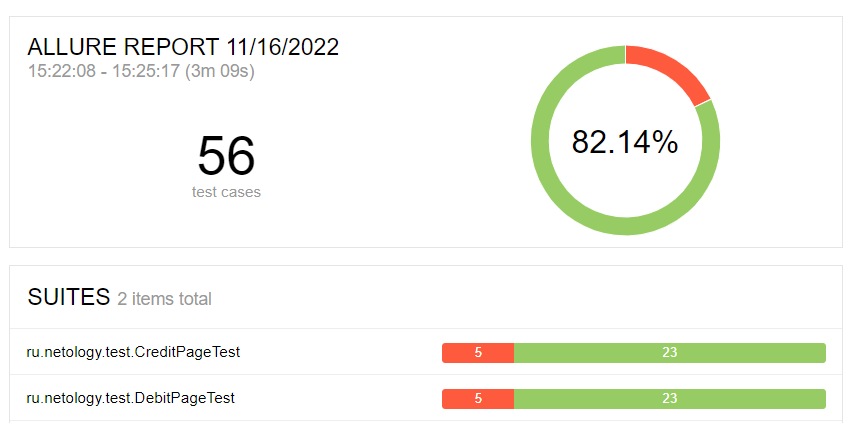

## Отчёт о проведённом тестировании

**Задача:** Провести тестирование функциональности сервиса aqa-shop.jar для покупки тура по карте или в кредит.

---
### Результаты тестирования

**Общее количество тест-кейсов**: 56

**Успешно пройденных:** 82.14% / 46 тестов

**Failed:** 17.85% / 10 тестов

**Всего найдено багов:** 12

---
### Общие рекомендации:

* Доработать валидацию полей, в особенности поля "Владелец";
* Уточнить требования к приложению в виде спецификации или ином более явном виде;
* Исправить найденные ошибки.

